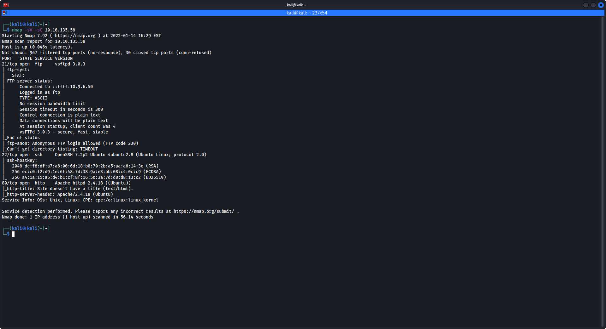
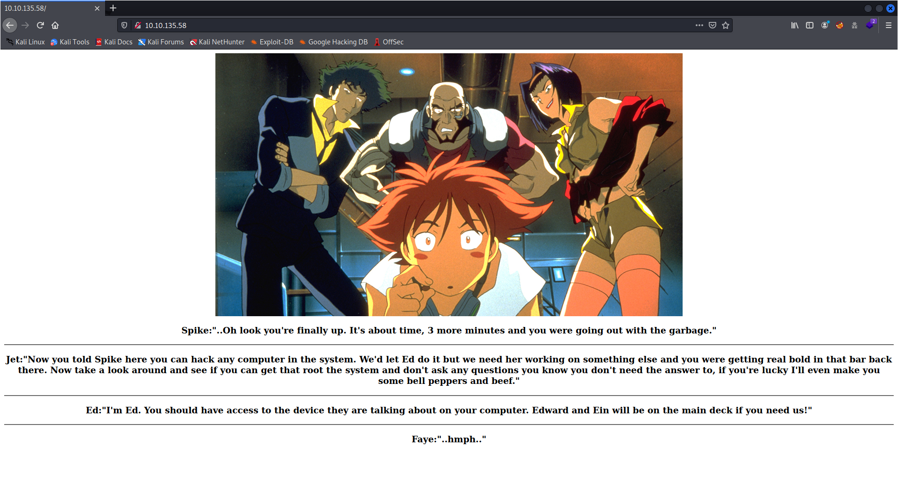
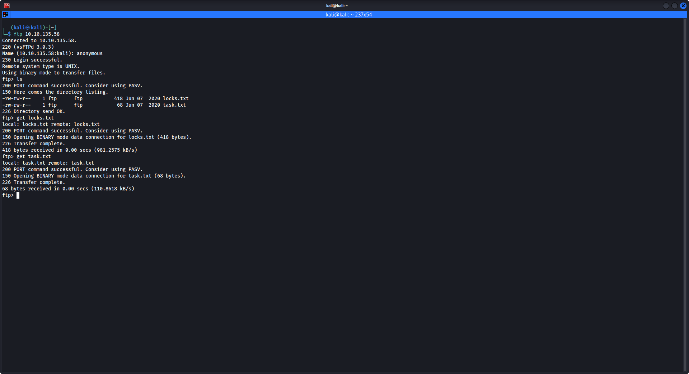
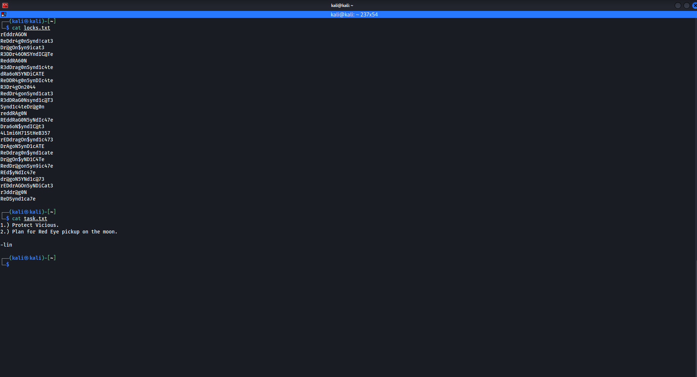
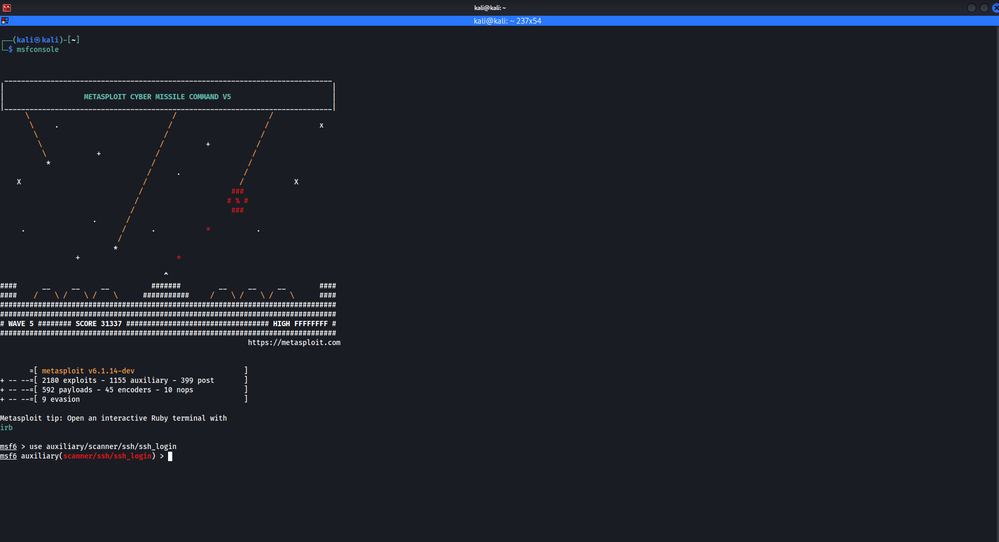
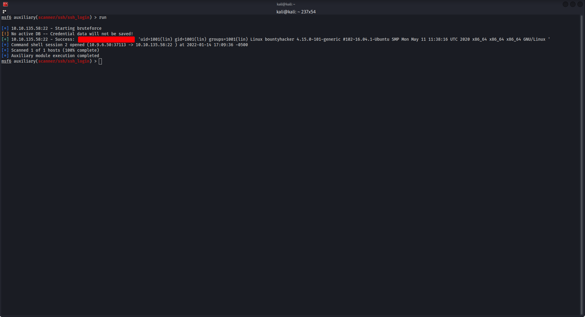
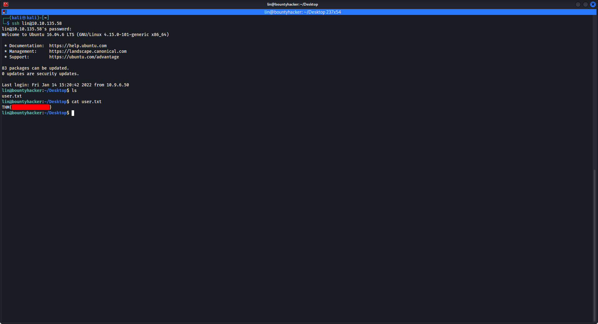
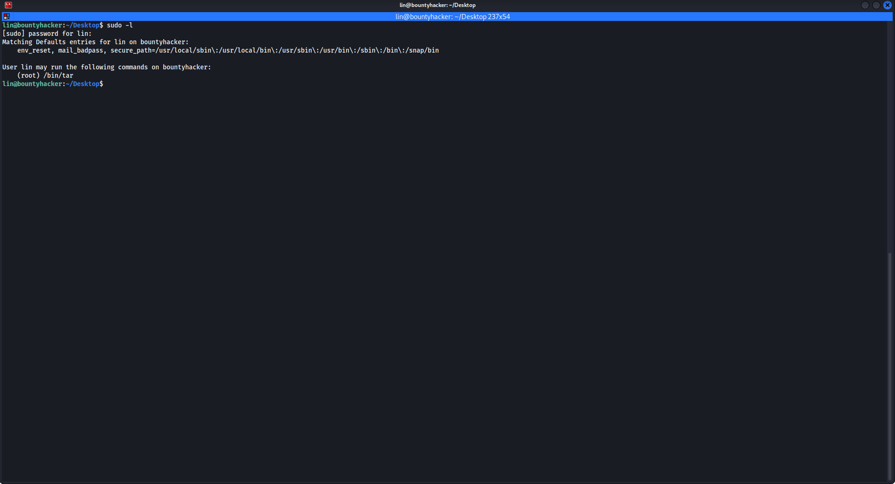
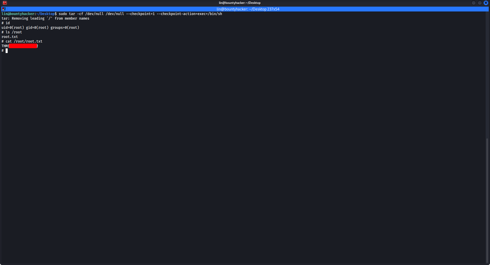

# **Bounty Hacker**

This is a writeup for the TryHackMe room Bounty Hacker.

We'll start off with an nmap scan.

```
nmap -sV -sC $ip
```




This scan shows us that three ports are open: port 21, port 22 and port 80. Let's check the website.



Nothing particularly interesting there, just some stuff to do with Cowboy Bebop.

Port 21 is used for FTP so let's check that.

```
ftp $ip
```

When prompted for a name input **anonymous**. Using the command `ls` we can see the files locks.txt and tasks.txt, let's use the command `get` to download those.





It seems that locks.txt is a list of passwords and task.txt contains a possible username **lin**. The name and these passwords can be used to bruteforce the ssh login, you can use metasploit for this.

Start metasploit with `msfconsole`, then we can take a moment to appreciate the the ascii art and the enter the command `use auxiliary/scanner/ssh/ssh_login`.



We then nedd to set the options **rhosts** `set rhosts $ip`, **username** `set username lin` and **pass_file** `set pass_file /path/to/locks.txt`.

Then type `run` and metasploit will bruteforce the ssh login for us.



With this login we can ssh into the server `ssh lin@$ip` and get the user flag.



Time to enumerate priv-esc vectors, first let's try `sudo -l`. This shows us that we can use the tar command with root privileges so let's check GTFOBins.



`sudo tar -cf /dev/null /dev/null --checkpoint=1 --checkpoint-action=exec=/bin/sh`, to get root.


